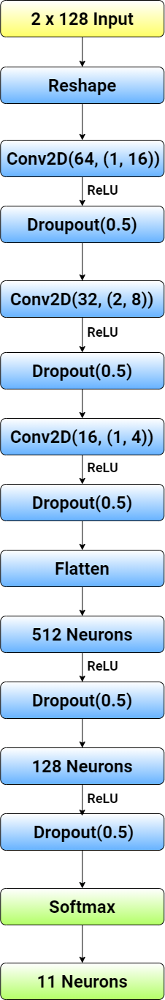

# Modulation Classification

## Table of contents

- [Description](#Description)
- [Model structure](#Model-structure)
- [Data in this project](#Data-in-this-project)
- [Files in this repo](#Files-in-this-repo)
- [Results](#Results)
- [Dependencies for this project](#Dependencies-for-this-project)
- [Running the code](#Running-the-code)

## Description

This project implements two deep learning (DL) models on classifying the modulation formats of various radio frequency (RF) signals. The two DL models are the Artificial Neural Network (ANN) and Convolutional Neural Network (CNN), while the radio frequency signals are generated by _GNU Radio software_ and consist of 11 modulation formats (8 digital and 3 analog) at varying signal-to-noise ratios (SNR).
Conducting modulation classification on the RF signals, this work compares the performance of ANN and CNN models at different values of SNR. Plus, this project applies Principal Component Analysis (PCA) technique on both ANN and CNN models. The purpose is to observes the trade-off relationship between the classification accuracy and the length of training time

## Model structure

| ANN                        | CNN                       |
| -------------------------- | ------------------------- |
|  |  |

## Data in this project

The original dataset in this project is publicly available on the [DeepSig RF Datasets For Machine Learning](https://www.deepsig.ai/datasets). The dataset is called RADIOML 2016.10A and is generously offered by _DeepSig Inc._

## Files in this repo

This GitHub repo contains the following folders or files

+ `img` folder contains the images of the training results, neural network structures, and test results

+ `model` folder contains all the trained ANN and CNN models used in this project

+ `ANN_vs_CNN.ipynb` is the code for comparing the performance of ANN and CNN on classifying the modulation schemes of the RF signals in dataset

+ `ANN_using_PCA.ipynb` and `CNN_using_PCA.ipynb` are the code for applying PCA on the original dataset and observing the performance of ANN and CNN versus different values of dimension reduction 

+ `ANN.ipynb` and `CNN.ipynb` are the prototype of ANN and CNN models at the beginning stage of this project

+ `Project_Report.pdf` is the report of this project, which contains specific technical details and in-depth discussion

## Results

### Comparison between ANN and CNN


&nbsp;

### Comparison between ANN and CNN with PCA

| ANN                   | CNN          |
| -------------------------- | ------------------------- |
|  |  |

## Dependencies for this project

This project requires the following python modules:

```python
numpy  matplotlib.pyplot  pickle  sklearn  random  tensorflow.keras  seaborn  time
```

Please make sure you have all the modules installed before running the code. For installing these modules, one can use command `pip install` or `conda install`

## Running the code

1. [Click here](https://opendata.deepsig.io/datasets/2016.10/RML2016.10a.tar.bz2?__hstc=24938661.1c9f367bab527ec310ee0e32f379e4f2.1613644327279.1617502421902.1620095214064.6&__hssc=24938661.1.1620095214064&__hsfp=2651515268) to download the dataset for this project. It may require contact verification before downloading the dataset

2. Extract the dataset from the zipped folder into a folder named `data`

3. Download this repository to your local machine

```bash
git clone https://github.com/zhaoshengEE/Modulation_Classification.git
```

4. Relocate the `data` folder into the repository

5. Start your journey on this project
