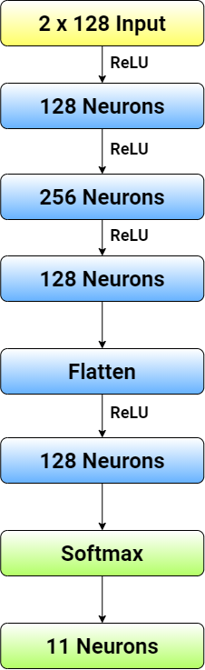
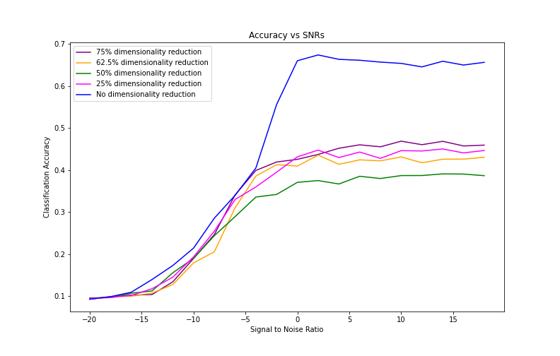

# Modulation Classification

## Table of contents

- [Description](#Description)
- [Model structure](#Model-structure)
- [Data in this project](#Data-in-this-project)
- [Files in this repo](#Files-in-this-repo)
- [Results](#Results)
- [Dependencies for this project](#Dependencies-for-this-project)
- [Download the code](#Download-the-code)

## Description


## Model structure

| ANN                   | CNN          |
| --------------------- | --------------------- |
|  |  |

## Data in this project


## Files in this repo


## Result

### Comparison between ANN and CNN


### Comparison between ANN and CNN with PCA

| ANN                   | CNN          |
| --------------------- | --------------------- |
|  |  |

## Dependencies for this project


## Download the code

One can download all the code files in this repository by cloning this repo

```bash
git clone https://github.com/zhaoshengEE/Digital_Modulation_Classification.git
```